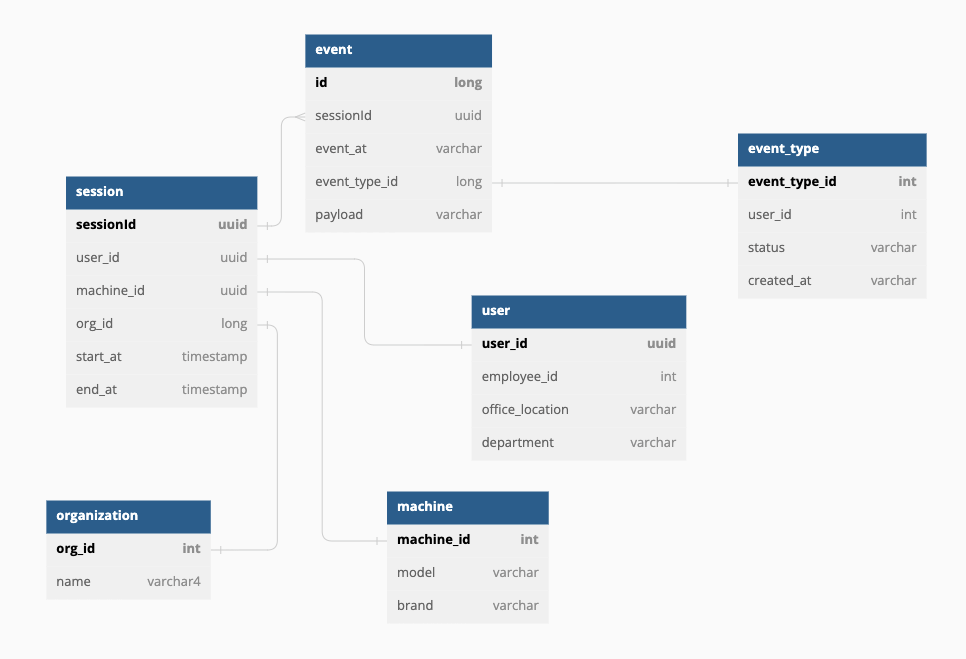

# Tracking Microservice (TMS).
## Requirements 

During brainstorming session, our business analyst jotted down following points which will serve
as requirements for such system.
* We want to develop a microservice that takes of tracking user and machines on different
platforms like mobile, web, desktop and embedded device
  * End user usually interacts via mobile, web, desktop app
  * Machine has embedded security credentials and talk via some embedded device
* When user open app, a session is started
* When user logs out or closes app, session is closed
* Each session has multiple events attached to it and posted frequently
* For optimization purposes, infrequently endpoint would be called to add batch of events
* Events can be added via other microservice. When microservice calls TMS API, they already have session id. At max 2500 events would be clubbed into one
* After session is established, each interaction from app or machine will contain a session-id so that trace can be created from data collected
* In theory one can track
  * From which app to which app user navigates in a session
  * Which apps and microservices are used in a session
  * Which microservices are consumed by machines
  * Which events occurred on machine and draw a timeline out of it

## Database schema

This is the proposed database schema. The only two tables that we are aware of are session and event (they are also the only ones implemented in the application
The rest of the tables are shown here as a proposal.

One particular suggestion would be not to store any personal information on the user table so that we don't need to add extra security measures to ensure privacy.

The two implemented tables are represented in the SessionEntity and EventEntity objects, and their one to many relationship between can be seen in the sessionEvents and session attributes. 
The owner of this relationship is the SessionEntity, which can be good as a first approach since we only need to implement one repository. But, on the other side,
it also brings us consistency issues if the retrieved session is not the latest version, making us lose events when updating. To solve this we are forced to apply pessimistic locking to the database, losing performance along the way.

If we made the EventEntity the owner of the relationship we could still have consistency issues (for example if a session was deleted we could have retrieved it before), but they would be less common, and we could leave with optimistic locking without major impact. 

## Future improvements

* The first thing we should do is finish the unit tests and add a couple of integration tests (specially for the jpa repositories). There are also a lot of TODOs left to complete in the application.
* Add a dedicated websocket to receive events.
* Use spring security to add authentication and authorization to the project.
* If in the future we have a big load of events incoming (as it is expected), we could have bottlenecks in the database. To solve this issue the optimal action would be to decouple the request processing part and the part that saves the event in the database.
For this we could use a producer-consumer architecture with a queue in the middle. The main application would handle the requests and them send the processed event to the queue. 
The consumer application would then save those events in the database. If we have troubles processing events we can always scale up the number of applications so the events are always processed. 
On the other side, the queue could also throttle the amount of database saves to prevent overload
